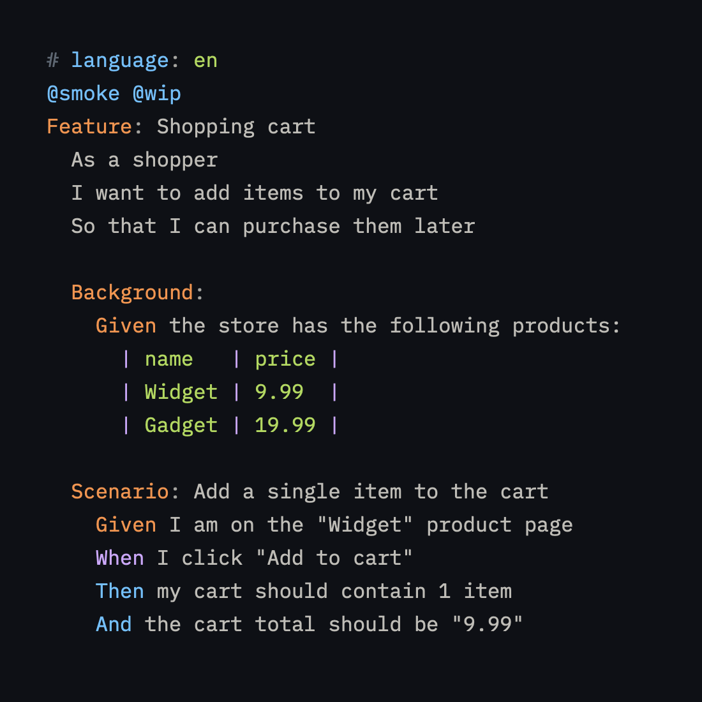

# zed-gherkin

A [Zed](https://zed.dev) extension that adds syntax highlighting for Gherkin
`.feature` files (Cucumber and other BDD tools).

It uses the [tree-sitter-gherkin](https://github.com/binhtddev/tree-sitter-gherkin)
grammar. Only syntax highlighting is provided for now.

## Try it locally

1. Open Zed.
2. `Cmd-Shift-P` → `zed: install dev extension`.
3. Select this directory.
4. Open `test/example.feature` to see highlighting.

## Structure

- `extension.toml` — registers the extension and the `gherkin` tree-sitter grammar.
- `languages/gherkin/config.toml` — associates `.feature` files with the grammar.
- `languages/gherkin/highlights.scm` — highlighting query.
- `test/example.feature` — sample file covering tags, backgrounds, scenario
  outlines, examples tables, rules, and doc strings.
